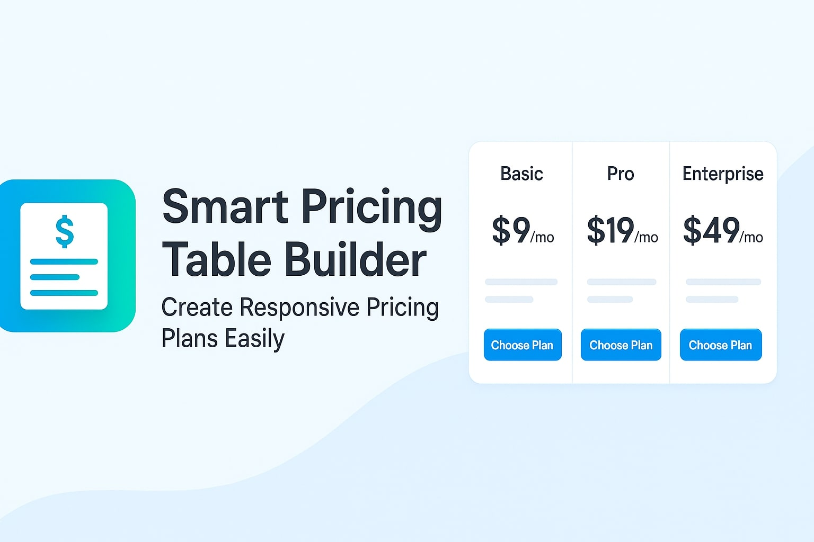

<p align="center">
  
</p>

# Smart Pricing Table Builder

**Create beautiful, responsive pricing tables for WordPress with toggle, dark mode, export to PDF, and more — no coding needed!**

---

## ✨ Features

- 📊 Build modern, responsive pricing tables easily
- 🔀 Monthly and Yearly toggle switch
- 🌑 Light and Dark Mode support
- 📥 Export pricing table as PDF
- 📋 Copy pricing table HTML to clipboard
- 🎨 Gradient buttons and stylish layout
- 🖥️ 100% Mobile and Tablet Responsive
- 🔧 No external APIs required — fully self-contained
- 🔥 Lightweight and SEO friendly

---

## 🚀 Installation

1. Download the ZIP file or clone the repository.
2. Upload the plugin to your WordPress site:
   - Go to **Plugins > Add New > Upload Plugin**.
   - Choose the `smart-pricing-table.zip` file and install.
3. Activate the plugin.

---

## 🧩 Usage

- Create or edit any **Page** or **Post**.
- Insert the shortcode:

```plaintext
[smart_pricing_table]
